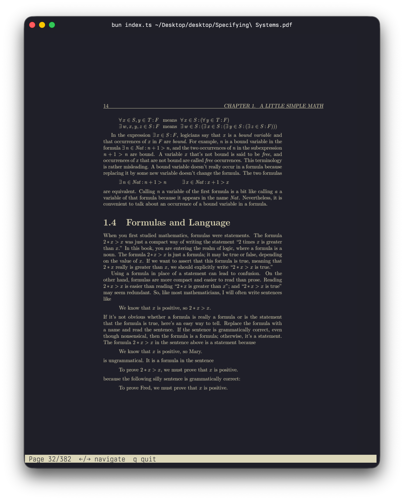
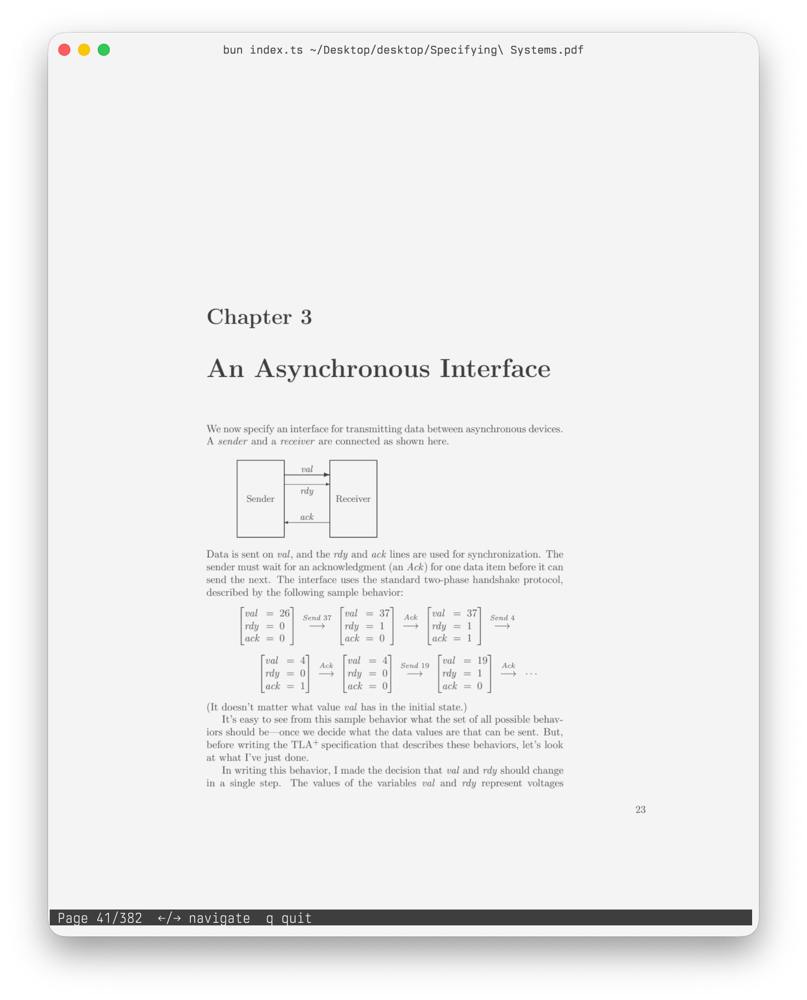

# dark-pdf

A terminal PDF viewer using the Kitty graphics protocol. Renders PDF pages as images in the terminal, adapting colors to match your terminal's foreground/background theme.

| Dark | Light |
|------|-------|
|  |  |

## Usage

```bash
bun index.ts <file.pdf> [options]
```

### Options

| Flag | Description |
|------|-------------|
| `-p, --page N` | Start on page N (default: 1) |
| `--margin-top N` | Crop N pixels from the top |
| `--margin-bottom N` | Crop N pixels from the bottom |
| `--margin-left N` | Crop N pixels from the left |
| `--margin-right N` | Crop N pixels from the right |
| `--no-recolor` | Disable terminal color mapping |

### Usage

```bash
# Open a PDF
bun index.ts document.pdf

# Start on page 5
bun index.ts document.pdf --page 5

# Crop margins (useful for PDFs with large whitespace)
bun index.ts document.pdf --margin-top 40 --margin-bottom 40

# Disable color remapping
bun index.ts document.pdf --no-recolor
```

## Requirements

- A terminal with [Kitty graphics protocol](https://sw.kovidgoyal.net/kitty/graphics-protocol/) support (e.g. Ghostty, Kitty, etc)
